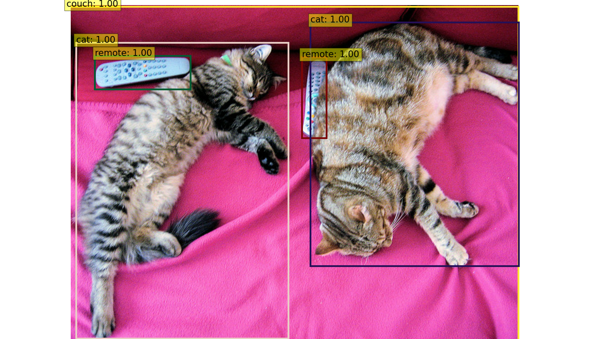

# Implementing DETR using TensorFlow

`DETR` aka **Detection Transformer** is a state-of-the-art object detection algorithm that was proposed by Facebook AI Research in 2020. Unlike traditional object detection methods, DETR frames the object detection task as a direct set prediction problem, which eliminates the need for explicit object proposals and post-processing steps. It employs the `Encode` and `Decoder` components of a Transformer network to process the input image and generate object detections.

## About this implementation

This GitHub project serves as my endeavor to explore and gain hands-on experience in the field of transformers. Through this project, I aim to enhance my knowledge and skills in this area while showcasing my progress and learning journey. 

For this project, I used a [git repo](https://github.com/Leonardo-Blanger/detr_tensorflow) which is implemented using TensorFlow as a reference and incorporated its weights and some scripts into my project. The author provided four weights, and I selected [detr-r50-e632da11.h5](https://drive.google.com/file/d/1Nd1P6g1mqqf6Gzl3BW1TavsjripA3Sa3/view?usp=share_link) from them.
This reference repo and the original implementation, both used multi-head attention mechanism. But I chose single-head attention instead. So the downloaded weights can't be direcly loaded to the DETR model. To tackle this problem, I saved model weights in numpy format for all layers except ResNet50 backbone, which I saved in h5 format. The weight-saving code is added to the [forked version](https://github.com/kavysabu1996/detr_tensorflow) of the reference repository.

## How to use this repo for object detection

create a python virtual environment and install all requirments

virtual env creation - `Ubuntu`
```
# in root directory
sudo apt update
sudo apt install python3-dev python3-pip python3-venv
python3 -m venv detr

#this will create a folder named detr in root directory
# activate this env by 
source detr/bin/activate
```

virtual env creation - `Windows`
```
# in root directory
pip install virtualenv
virtualenv detr

#this will create a folder named detr in root directory
# activate this env by
detr\Scripts\activate
```

install all requirements
```
pip install --upgrade pip
pip install --upgrade TensorFlow
pip install matplotlib
```

### Running object Detection

The `samples` folder contains 2 images for object detection. Default sample for running object detection is set as `sample2.jpg`. Additionally, this folder includes the image utilized by the author of the reference repository for the object detection demo.

For running object detection run this line of code

**loads default sample. ie. sample2.jpg**
```
python3 run.py
```
**give the image path as the argument to load image of your choice**
```
python3 run.py --image samples/sample1.jpg
```
**give the url as the argument to load image from web**
```
python3 run.py --image image_url
```

## Image annotations

**Sample2.jpg**


**Sample1.jpg**


## References
[detr_tensorflow](https://github.com/Leonardo-Blanger/detr_tensorflow): reference repo

## Acknowledgement
1. [Mr. Thomas Paul](https://github.com/mrtpk)
2. [Mr. Sambhu Surya Mohan](https://github.com/sambhusuryamohan)

